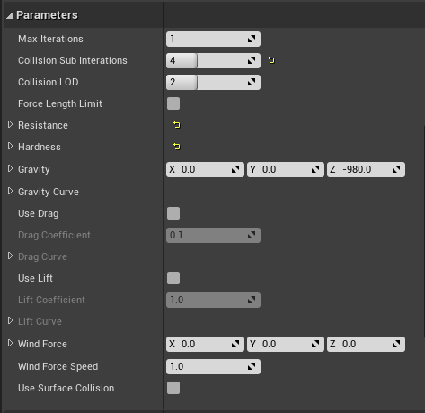
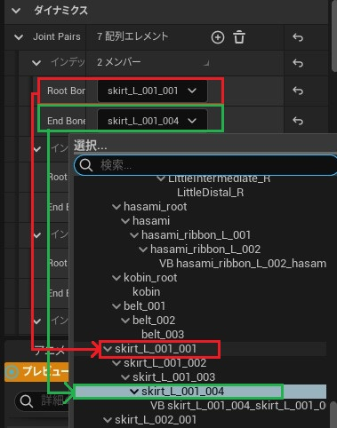
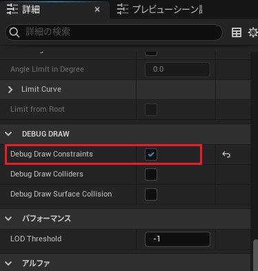
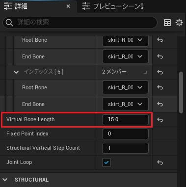
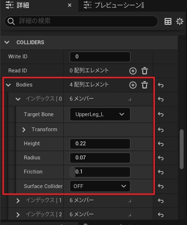

# SPCRJointDynamics for UE4  
A bone physics engine for cloth.  
  
## Overview  
Do you want to simulate cloth in your game with physics? Then this is the plugin for you.  
SPCRJointDynamics requires a basic bone setup, and you are good to go.  
* Unreal Engine 4.21 and above.  
  
## License  
* [MIT License](./LICENSE)  

## 使用方法
将E:\SPCRJointDynamicsUE4-master\Plugins\5.1\Plugins
目录下的SPCRJointDynamics文件夹
复制到
E:\SPCRJointDynamicsUE4-master\MyProject\Plugins
  
## Purpose of development  
  
There was a requirement in one of our games that the skirt of the character should perfectly interact with the character’s movement.  
  
## Unity plugin  
Get the Unity Plugin: https://github.com/SPARK-inc/SPCRJointDynamics  
  
## Specifications  
SPCRJointDynamics uses cross simulation algorithm (mass-spring-damper model) to animate the bones in real-time. We mainly focused on the overall appearance rather than the physically accurate behaviors for direct use for skirts and hairs.  
Since adding bones is still a manual process in most 3D software, and therefore bones are not always correctly aligned. To overcome this issue, we made a constraint base plugin.  
  
## Each constraint.  
  
  
## Advance Preparation  
  
  
The plugin is developed to work with an animation blueprint graph, you can search the SPCRJointDynamics node in the blueprint node search box and add it to the animation blueprint graph. And once all the parameters are set, connect the node to the Output Pose node to run the simulation.  
  
## How to use  
Basic bone setup  
  
  
Dynamics property is the settings related to the bone setup.  
Click on the [+] icon on the Joint Pairs array to add a new element.  
Then select the first bone from the bone hierarchy in the Root Bone and the last child bone from the same bone hierarchy in the End Bone as one pair, the bones in-between them will automatically be connected like a chain.  
  
**Fixed point index:** This is an index of fixed bones (no physics applied) from the root. By default, the value is 0, which means only the root bone will be fixed. But you can put any index value, up to that index all bones will be fixed. In other words, no physics will apply to those bones.  
  
**Structural vertical step count:** The number of vertical structural constraints. Higher value makes it more stable but has some performance impact.  
  
**Joint Loop:** Whether to make a bone loop. If true, connects the first and the last bone.  
For example, a round-shaped skirt requires all bones to be connected in a loop, so that all the bones will move seamlessly without occurring cloth tearing. However, cloak-like clothes are not rounded in shape, therefore a joint loop is not necessary in this case.  
  
## Bone restraint settings  
  
  
Setting the restraint parameters for the bones.  
There are three main types of restraint settings available.  
**Structural:** The most basic restraint for constructing a structure. For example, a chain of bones.  
**Shear:** This restraint prevents the bone from twist.  
**Bend:** This restraint prevents the bone from bending.  
  
Each constraint is having its own parameter settings.  
**Curve Setup:** While setting the curve, if you set the tip tighter and the end slightly looser, then the movement of the bones will be smoother.  
  
Look at the following curve example.  
  
  
For commonly used items such as cloth and hair, it is usually desirable to specify a restoring force of 1.0 when the vertical structure is stretched.  
  
**Note:** In SPCR joint dynamics, you can assign different values to each bone by assigning the float curve asset in the respective field. The value for the tip bone will be calculated from the 0th keyframe and the value for the end bone will be calculated from the 1st keyframe. And the value for the in-between bones will be calculated from the 0~1 ratio.  
  
**Collision:** You also can enable or disable the collision checks in each restraint. Even though the restraint is running, but if the collision check box is off, the collision will not occur.  
  
Use-case for the hair typed bones (hairs in the example scene): in the case of hairs, turn on the collision only for structural constraints. No need to enable a collision check for shear and blend restraints. Since they are just used for maintaining the shape.  
  
**Parameter settings**  
  
  
**Max Iterations:** Number of iterations of the physics process. It improves the quality of the physics simulation by paying the performance costs.  
  
**Force Limit Length:** Prevents the changes in the length.  
**Resistance:** The value for resisting to move. Value is in between [0 ~ 1]  
**Hardness:** Sets how hard the bone is to move. Value is in between [0 ~ 1]  
**Gravity:** Gravity vector for physics.  
**Wind Force:** Wind force vector for physics.  
**Wind force speed:** Wind speed for the current wind (wind speed scalar).  
**Use surface collision:** Whether to use surface collision for this node.  
  
**Collider settings**  
  
  
**Write Id:** If you wanted to use this SPCR node’s colliders in other SPCR nodes, then you need to specify a unique write Id (other than 0) for this collider. By setting this value, the collider array (Bodies) will be exposed as a global.  
**Read Id:** If you wanted to access other SPCR node’s colliders in this node then you need to specify that node’s unique write Id in the Read ID array.  
**Point Collision:** Allow collision with bones. The most performant collision check process but the collision is not very smooth compared to surface collision.  
**Bodies:** Array of colliders. If the height is 0.0 then the collider will be treated as a sphere collider and if the height is greater than 0.0 then it will be treated as a capsule collider.  
  
**Limit**  
  
You can prevent the bone to go beyond a certain angle.  
**Limit angle:** On/Off checkbox for angle limit.  
**Angle limit in degree:** Max angle of the bone.  
**Limit Curve:** Root ~ child curve value for this limit, bone values from 0~1 keyframes.  
**Limit from root:** If true, then limit the angle from the root bone. Otherwise, limit the angle from the parent bone.  
  
**Debug Draw**  
Debug options allow you to visualize the mapped joints.  
**Debug Draw Constraints:** Draw debug constraints joints.  
**Debug Draw Colliders:** Draw outline for colliders.  
**Debug draw surface collision:** Draw surface collision triangles.  
  
**List of all parameters**  
  
  
**Other**  
UE4 intermediator handling is not very good, so there might be some unrelated steps involved.  
Please feel free to let us know if you have any questions or suggestions.  
  
  
  
# Example of skirt setup procedure  
  
First, select SPCR Joint Dynamics on AnimBP and create a node.  
  
  
We will set up a pair of bones to perform the physics behavior.  
In this section, we will pair the root and end bones of the skirt bones and proceed with the settings.  
  
  
Since the skirt is on a circle, check the "Joint Loop" checkbox so that the start and end points are connected.  
  
  
Let's turn on the debug display so that we can visualize the state of the physics constraints here.  
  
  
The constraint state is now shown in lines on the preview screen.  
  
  
We will add the necessary restraints.  
All the restraints are enabled here, as the skirt will keep its shape to some extent and also support the penetration of the legs.  

  
You can see in the preview screen that the constraints are correctly applied.  
However, if you look closely, you can see that the end of the skirt is not constrained.  
This is because UE4 doesn't import the End Bone, so the end bone is deleted.  
We could have added virtual bones to the skeleton, but it would have been too expensive to set them up one by one, so we'll take a different approach.  
  
  
By setting the length of the virtual bone to a value greater than or equal to 0 in the "Virtual Bone Length" field, a virtual bone for calculation will be automatically added to the end.  
  
  
A virtual bone has been added at the specified length from the end bone and a new constraint has been generated.  
  
  
The next step is to set the restraint force for each restraint.  
The default value of 1.0 will result in a stiff skirt because it will try to maintain its initial shape.  
This is fine if the skirt contains panniers, but in this case we want a softer skirt, so we have lowered the value.  
  
  
The curve that you set should also be softer towards the end.  

  
The last step is to set up the collider.  
Add the collider and set the target bone and size.  
It would be a good idea to add it in a way that it follows the foot.  

  
This is the screenshot of the setting for the legs, but the skirt doesn't poke through anymore.  
It's a good idea to add colliders to the waist and abdomen in case the skirt comes up.  
